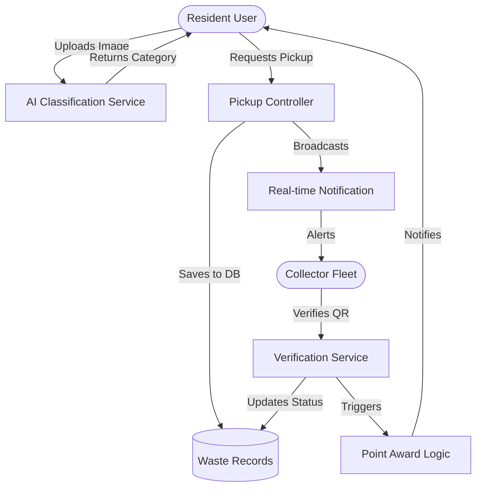
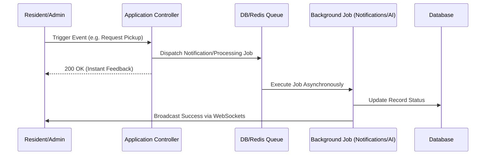

<p align="center">
  
</p>

# EcoTrack-NG — Intelligent Waste Management & Recycling Marketplace

EcoTrack-NG is a cutting-edge, enterprise-grade platform designed to revolutionize waste recovery in Nigeria. By connecting residents, collectors, and recyclers, we turn **Waste into Wealth** through AI-powered classification, real-time logistics, and a robust digital reward system.

**[Live Demo: ecotrack.forahia.org.ng](https://ecotrack.forahia.org.ng)**

---

## 🚀 Key Features

- **🧠 AI Waste Classification**: Real-time identification of recyclables (Plastic, Metal, Glass, etc.) using Google Vision AI.
- **💰 Waste-to-Wealth Rewards**: Earn digital tokens for every gram of waste recycled, redeemable for various incentives.
- **⚡ Real-time Connectivity**: Live notifications for pickup requests, verifications, and point awards via Pusher.
- **🚛 Geospatial Logistics**: Smart routing and territory management for collectors to optimize recovery.
- **📊 Role-Based Control Centers**: Sophisticated, high-interaction dashboards for Residents, Collectors, and Admin.
- **📱 PWA Ready**: Mobile-first architecture optimized for low-bandwidth environments.

---

## 🛠 Tech Stack

- **Backend**: Laravel 12 (PHP 8.3)
- **Frontend**: React 18, Inertia.js, Vite
- **Styling**: Tailwind CSS & Framer Motion (Premium Animations)
- **Real-time**: Pusher (WebSockets)
- **AI/ML**: Google Cloud Vision API
- **Maps**: Google Maps Platform (JavaScript API)
- **Icons**: Lucide React
- **Database**: MySQL (with Geospatial query support)

---

## 🏗 System Architecture & Documentation

### System Overview
EcoTrack-NG utilizes a modern **Monolithic Architecture** with a decoupled frontend. Laravel serves as the robust API and routing engine, while React handles the dynamic UI via Inertia.js, providing a seamless SPA experience without the complexity of a separate API layer.

### Core Services
- **Vision Service**: Interfaces with Google Cloud Vision for intelligent waste category detection.
- **Logistics Engine**: Manages territory-based assignments and collector availability.
- **Reward Engine**: Atomic transaction processing for point allocation and balance management.
- **Notification Hub**: Handles multi-channel event broadcasting (Web, Push).

---

## 🔄 Data Flow



---

## ⚙️ Queue Flow



---

## 🏁 Installation Procedures

### Prerequisites

- PHP 8.3+
- Composer
- Node.js & NPM
- MySQL 8.0+

### Step-by-Step Setup

1. **Clone the repository**:
   ```bash
   git clone https://github.com/Chi-G/EcoTrack-NG.git
   cd EcoTrack-NG
   ```

2. **Install dependencies**:
   ```bash
   composer install
   npm install
   ```

3. **Configure Environment**:
   ```bash
   cp .env.example .env
   php artisan key:generate
   ```
   *Edit `.env` with your Database, Pusher, and Google Maps API credentials.*

4. **Initialize Database**:
   ```bash  
   php artisan migrate --seed
   ```

5. **Resource Compilation & Server**:
   ```bash
   # Run frontend compiler
   npm run dev
   
   # Start Laravel server
   php artisan serve
   
   # Start Queue worker (Crucial for notifications)
   php artisan queue:work
   ```

---

## 📄 Documentation & API

- **[Interactive API (Swagger)](https://ecotrack.forahia.org.ng/api/documentation)**: Full system schema and endpoint documentation.
- For internal logic flowcharts and database ERDs, refer to the `.docs` foldere.

---

## 🛡 License

EcoTrack-NG is open-sourced software licensed under the [MIT license](LICENSE).
