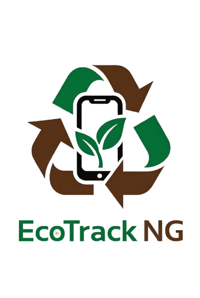

<p align="center">
  
</p>

# EcoTrack-NG 🌍♻️
### Intelligent Waste Management & Recycling Marketplace

EcoTrack-NG is a cutting-edge platform designed to revolutionize waste management in Nigeria. By connecting residents, collectors, and recyclers, we turn **Waste into Wealth** through intelligent classification, real-time logistics, and a robust digital reward system.

---

## 🚀 Key Features

- **🧠 AI Waste Classification**: Real-time identification of recyclables (Plastic, Metal, Glass, etc.) using Google Vision API.
- **💰 Waste-to-Wealth Rewards**: Earn digital tokens for every gram of waste recycled, redeemable for various incentives.
- **⚡ Real-time Notifications**: Live updates on registration, pickup requests, and successful transactions via Pusher.
- **🚛 Optimized Logistics**: Smart routing for collectors to streamline waste recovery in urban areas.
- **📊 Role-Based Dashboards**: Tailored experiences for Residents, Collectors, and Recyclers with high-impact data visualization.
- **📱 PWA Ready**: Designed for mobile-first accessibility in low-network environments.

---

## 🛠 Tech Stack

- **Backend**: [Laravel 12](https://laravel.com) (PHP 8.2+)
- **Frontend**: [React](https://reactjs.org) with [Inertia.js](https://inertiajs.com)
- **Styling**: [Tailwind CSS](https://tailwindcss.com) & [Framer Motion](https://www.framer.com/motion/) (Animations)
- **Real-time**: [Pusher](https://pusher.com)
- **AI/ML**: [Google Cloud Vision API](https://cloud.google.com/vision)
- **Database**: [MySQL](https://www.mysql.com/) (with Geospatial support)

---

## 🏁 Getting Started

### Prerequisites

- PHP 8.2+
- Composer
- Node.js & NPM
- MySQL

### Installation

1. **Clone the repository**:
   ```bash
   git clone https://github.com/Chi-G/EcoTrack-NG.git
   cd EcoTrack-NG
   ```

2. **Install dependencies**:
   ```bash
   composer install
   npm install
   ```

3. **Configure Environment**:
   ```bash
   cp .env.example .env
   php artisan key:generate
   ```

4. **Database Setup**:
   ```bash
   php artisan migrate --seed
   ```

5. **Run the Application**:
   ```bash
   # Terminal 1: Laravel Server
   php artisan serve
   
   # Terminal 2: Frontend Asset Compilation
   npm run dev
   
   # Terminal 3: Background Queue Worker
   php artisan queue:work
   ```

---

## 📄 Documentation

- **Phase 1**: [Foundation & Database](database/migrations)
- **Phase 3**: [AI Integration Infrastructure](app/Services/AiService.php)
- **Phase 9**: [Real-time Connectivity](app/Notifications)

---

## 🛡 License

EcoTrack-NG is open-sourced software licensed under the [MIT license](LICENSE).
